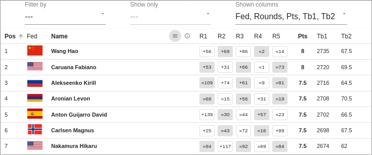

# Chess Tournament Grid Viewer

---

[](https://dev.azure.com/antonteleshev/tourn-grid-view/_build/latest?definitionId=1&branchName=master)

---

This component, developed in ReactJs, provides a possibility to render interactive chess tournament grids in HTML pages.

It is particularly useful in a static HTML context, because it does not require any back-end services.

The main scenario is: having source data in the CSV format, include it into a HTML page according to the requirements below and invoke this library script. So, having initial raw data like these:

```csv
Pos,Fed,Name,Rating,R1,R2,R3,R4,R5,Pts,TB1,TB2
1,CHN,Wang Hao,2726,+56W,+69B,+86W,=2B,=14W,8,2735,67.5
2,USA,Caruana Fabiano,2812,+53B,+31W,+66B,=1W,=73B,8,2720,69.5
3,RUS,Alekseenko Kirill,2674,=109B,+74W,+61B,=9W,=81B,7.5,2716,64.5
4,ARM,Aronian Levon,2758,=68B,=15W,+56B,+31W,=19B,7.5,2708,70.5
5,ESP,Anton Guijarro David,2674,+139W,=30B,=44W,+57B,=23W,7.5,2702,66.5
6,NOR,Carlsen Magnus,2876,+25W,=43B,=72W,=16B,+89W,7.5,2698,67.5
7,USA,Nakamura Hikaru,2745,=94B,+117W,=92B,=69W,=84B,7.5,2674,62
```

the tool should produce the following output:



The interactivity of the grid includes:

* the choice of the columns to be shown in the grid (the "Shown columns" selector in the top-right corner in the image above);
* the filtering of the data by the values in the columns (for example, show only the players from a chosen country, club or belonging to a chosen rating group);
* the sorting of the rows by values in different columns (ascending or descending, by clicking on the column headers);
* the possibility to show only the players who have been the opponents of the selected player (by clicking on a row in the grid).

## Usage

The steps to use this library are simple:

1. Include the required scripts and their dependencies by adding the script entries in the HTML page:

```html
<script src="https://cdn.jsdelivr.net/gh/atelechev/tourn-grid-view@{commit_hash}/dist/tourn-grid-view-vendor.min.js"></script>
<script src="https://cdn.jsdelivr.net/gh/atelechev/tourn-grid-view@{commit_hash}/dist/tourn-grid-view.min.js"></script>
```
The `tourn-grid-view-vendor.min.js` must precede the `tourn-grid-view.min.js` script.

2. Add the raw CSV data wrapped into a HTML element having an `id` and preferably hidden:

```html
<div id="demo" style="display: none;">Pos,Fed,Name,Rating,R1,R2,R3,R4,R5,Pts,TB1,TB2
1,CHN,Wang Hao,2726,+56W,+69B,+86W,=2B,=14W,8,2735,67.5
<!-- other CSV rows follow -->
</div>
```

The CSV data should not have blank lines.

3. Define a HTML element which will contain the rendered grid. It must have an `id`:

```html
<div id="demo-grid"></div>
```

4. Inside the body of the page, add a script that invokes the tool and provides a configuration for the grid:

```html
<script>
  window.onload = () => {
    TournamentGrid.renderGrid({
      idCsvElement: 'demo',
      idGridContainer: 'demo-grid',
      hiddenColumns: ['Rating'],
      useFilters: ['Rating', 'Fed'],
      enableOrderingColumns: ['Pos', 'Name'],
      lang: 'en'
    });
  };
</script>
```

Some examples of the usage of this tool are available in the `examples` folder of this project and on the pages [listed here](https://www.lareineblanche38.fr/p/annales.html).

### UI Controls

The "menu" button present in the `Name` column header allows to show or hide the filter selection controls.

### Configuration Options

The configuration of the grid can be done with an object containing the following values:

```javascript
{
  enableOrderingColumns: string[],
  idCsvElement: string,
  idGridContainer: string,
  interactive: boolean,
  hiddenColumns: string[],
  lang: string,
  useFilters: string[]
}
```

`idCsvElement` is the ID of the element from step 2, the one that is expected to contain the raw CSV data. This value is _mandatory_.

`idGridContainer` the ID of the element from step 3, the one that is supposed to host the grid to render. This value is _mandatory_.

`interactive` is an optional boolean which enables the interactive features of the grid. The default value is _true_. If set to _false_, no control panel will be available above the grid, the sorting and the filtering will be disabled on the rendered table.

`hiddenColumns` is an array of the names of the CSV columns that should not be shown in the initially rendered view. This value is _optional_.

`useFilters` is an array of the names of the CSV columns for which the filters should be enabled. This value is _optional_.

`enableOrderingColumns` is an array of the names of the CSV columns for which the sorting should be enabled. This value is _optional_.

`lang` is the two-digits code of the source language of the data. This value is _mandatory_. Currently, only the `en` (English) and the `fr` (French) languages are supported by the tool.

The column names specified in the configuration options must match the ones in the header of the raw CSV data.

### Requirements for CSV Data

In order to be transformed and rendered properly into a grid representation, the raw CSV data must conform with the following requirements.

The column names belows are not case sensitive. The original values are lower-cased and their first letter is capitalized when they are rendered in the grid header.

The `pos` (for _position_) column must be present in the CSV header. _This is the only mandatory column_. Its data are expected to contain the values of the positions of the players, in integer numbers. The values should be unique in this column.

If the `rating` column is present in the CSV, it is expected to contain numeric values. Unlike the other filterable columns, the filtering on player ratings is possible in rating groups of 200 points. For example, 1400 to 1599, 1600 to 1799 etc.

The `fed` (for _federation_) column is expected to contain alpha-3 country codes (having the length of three letter characters). The values in this column are transformed into SVG images from the Github [hjnilsson/country-flags](https://github.com/hjnilsson/country-flags) repository.

The names of the columns corresponding to the rounds of the tournament are expected to respect the pattern `R{number}`. For example, `R1` for round 1, `R2` for round 2 etc. The `Rounds` identifier is used to denote all the columns that respect this pattern. For example, if the tournament consists of 11 rounds and you need to hide the columns `R1`... `R11` in the initial view, it can be done with the option `hiddenColumns: ['Rounds']`.

The cells with the game results are expected to respect the pattern

    {game result}{opponent position}{color} | {bye}

`{game result}` must be `+` (won), `=` (drawn), `-` (lost), `>` (won by forfeit) and `<` (lost by forfeit).

`{opponent position}` must denote the position of the opponent with whom the player encountered in this round. The value must correspond to a value in the `Pos` column.

`{color}` is the first character of the name of the pieces color. In English, `W` (white) or `B` (black). In French, `B` (blanc) for white or `N` (noir) for black.

`{bye}` is a language specific value when the player was not paired in the respective round. The expected values are `BYE` in English and `EXE` in French.

Examples of valid values:

* `+1B` (English) - the player has won with black against the opponent who finished the 1st.
* `=12N` (French) - the player has drawn with black against the opponent who took the 12th place.
* `-3W` (English) - the player has lost with white against the opponent who finished the 3rd.

In the rendered grid, the color of the pieces is transformed into the background color of the respective cell.

If the value does not respect the pattern, the background color of the cell is assigned with the pale red.

The ordering of the columns in the raw CSV data can be chosen freely and is not significant.

## Development

This project uses ReactJs, with a customized configuration of Webpack.

It requires NPM to be installed on the host for developement.

Please check the `scripts` section of the `package.json` file for the list of available `npm` commands.


## License

This software is distributed under the terms of the MIT license, included in the `LICENSE` file.
